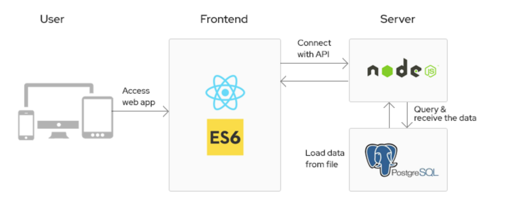

### Description

MVC Database application is based on MEAN stack and provides an good starter to build a 3 tier microservice application and deploy them on any platforms like Kubernetes and OpenShift. The application consists of an **Database** , **React based Frontend** and **Express using NodeJS** backend.

### Architecture

This stack consists of PostgreSQL, Express, React and Node.js. Combining these technologies, one can build a full-stack web application with CRUD operations. Everyone must have heard about MEAN Stack which is basically a JavaScript Stack for the deployment of full-stack web development and contains 4 technologies, namely: MongoDB, Express, React and Node.js. 

**Stack Components:**

1. **MongoDB (NoSQL Database)**

    MongoDB is an open-source document database built on a horizontal scale-out architecture. Founded in 2007, MongoDB has a worldwide following in the developer community.Instead of storing data in tables of rows or columns like SQL databases, each row in a MongoDB database is a document described in JSON, a formatting language. 

    **Why use MongoDB?**

    - Free and open source.
    - Available in multiple languages.
    - Highly extensible.
    - Protects data integrity.
    - Builds fault-tolerant environments.
    - Robust access-control system

2. **Express (Back-End Framework)**

    It is a web application framework for Node.js. Being a free and open software, it is used for building web applications and specially APIs. Express provides a thin layer of fundamental web application features, without obscuring Node.js features that you already know.

    **Why use Express?**

    - Provides a robust set of features for both web and mobile applications
    - Makes back-end code easier and simpler to write.
    - Supports many middleware.
    - Minimal and Flexible web application framework.
    - Creating efficient and robust API is quick and easy.
    - Allows you to define an error handling middleware.

3. **React (Front-End Framework)**

    React is basically a JavaScript library for building user interfaces. It is easy, efficient and painless way to create Interactive UIs. It is maintained by Facebook and a community of individual developers and companies. Design simple views for each state in your application, and React will efficiently update and render just the right components when your data changes and for this reason only, it is used for developing single-page application or mobile applications.

    **Why use React?**

    - Virtual DOM in ReactJS makes user experience better and developer’s work faster
    - It guarantees stable code.
    - React allows its components to be reused saving time and effort.
    - Provides high performance.
    - Provide the feature of Virtual DOM.
    - SEO friendly!

4. **Node.js (JavaScript runtime environment)**

    Node.js is a JavaScript runtime built on Chrome’s V8 JavaScript engine for developing server-side and networking applications. Being an asynchronous event-driven JavaScript runtime, it is used to build fast and scalable network applications. Node.js is free and open source server environment that runs on many platforms.

    **Why Node.js?**

    - Provides event-driven and asynchronous features which makes it lightweight and efficient.
    - No buffering and thus, is very fast.
    - Highly Scalable.
    - Highly extensible.
    - Provides advantage of caching.
    - Handles thousands of concurrent connections with a single server.
    - Provides vast number of libraries.

*Code sample provided and maintained by EDGE team.*