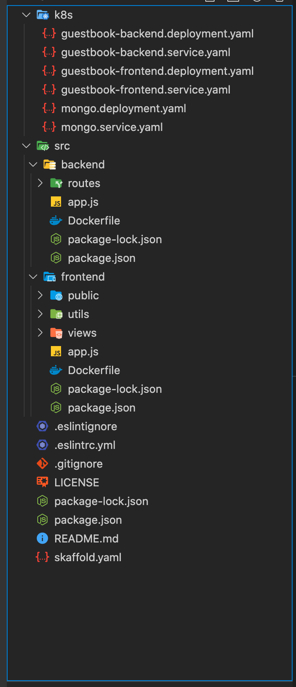

### Introduction

MVC Database application comprises of a MongoDB database , backend and frontend which are deployed indepently as a microservice.
The example also uses Skaffold which handles the workflow for building, pushing and deploying your application, allowing you to focus on what matters most: writing code.

### Access the application

Click on the Key icon on the Stack Builder Dashboard and copy the value under the `DNS` section and `IP` field

URL :  http://##DNS.ip##:30455

### Code Structure



It follows a simple modular and MVC pattern. There are 3 folders that are of our interest:
- k8s :  This contains all the deployment and service yaml for the application. This defines the deployment and exposure of our application.
- frontend: This contains the frontend code and uses Pug as a templating engine for view.
- backend: This contains all the backend code that is building using express js.

### Check the Resources deployed as part of Install Stack

Execute the below commands to check the resources deployed as part of Stack Install.

```execute
kubectl get pods
```

### Skaffold with Developer mode: Make Changes !! Deploy Instantly !!

Go to Developer Dashboard tab, it will provide you with the IDE along with the integrated terminal Click on the bottom status bar and select `TERMINAL`. You can also use the Terminal Tab and execute the commands on a click.  


In this example , we use `Skaffold` which simplifies local devlopment. You can deploy the application is DEV mode which keeps watching for the files changes and on any change, triggers the entire deployment process automatically without the user having to run and manage it manually.

Navigate to the example:

```execute
cd /home/student/projects/mvc-db-example
```

```execute
skaffold dev
```

On exiting the command, Skaffold will automatically destroy all the resources it created with above command.


Also, you can use the `skaffold run` to deploy the changes onto kubernetes as a normal mode. In this mode, the resources created remains unless the user deletes them.


### Clean up the Kubernetes resouces manually if created using `skaffold run`

You can delete all the resources created by executing the following command:
```execute
cd /home/student/projects/mvc-db-example
```
```execute
kubectl delete -f k8s/
```
